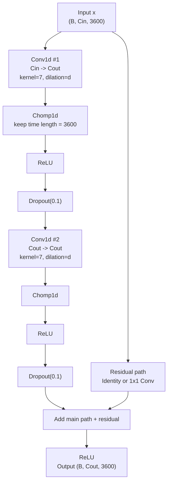

# CTG2 Multimodal Architecture

This file describes the current CTG2 model from `configs/ctg2_multimodal.toml`, `src/ctg_ml/models.py`, and the CTG2 preprocessing/training scripts.

## Current Config Snapshot

- CTG sequence length: `3600` timesteps (`60 min * 60 s * 1 Hz`)
- CTG channels: `5`
  - `FHR`
  - `toco`
  - `Hr1_SignalQuality==Y`
  - `Hr1_SignalQuality==R`
  - `padding_mask`
- Registry/tabular input width: `74` features after encoding
- TCN channels: `[32, 32, 64, 64, 64, 128, 128, 128]`
- Kernel size: `7`
- Dropout: `0.1`
- Tabular hidden size: `64`
- Fusion hidden size: `128`
- Apgar heads: `3 x 11-class`
  - `apgar1`
  - `apgar5`
  - `apgar10`
- Continuous regression heads: `2`
  - `ph_navelartar`
  - `ph_navelven`
- Binary heads: `5`
  - `ph_navel_below7`
  - `shoulder_dystocia`
  - `treatment_for_hypoglycemia`
  - `neonatal_sepsis_or_pneumonia`
  - `respiratorbehandling`

## Compact Flow

```mermaid
flowchart LR
    A["CTG sequence<br/>(B, 5, 3600)"] --> B0["TCN Block 0<br/>5 -> 32<br/>dilation=1"]
    B0 --> B1["Block 1<br/>32 -> 32<br/>dilation=2"]
    B1 --> B2["Block 2<br/>32 -> 64<br/>dilation=4"]
    B2 --> B3["Block 3<br/>64 -> 64<br/>dilation=8"]
    B3 --> B4["Block 4<br/>64 -> 64<br/>dilation=16"]
    B4 --> B5["Block 5<br/>64 -> 128<br/>dilation=32"]
    B5 --> B6["Block 6<br/>128 -> 128<br/>dilation=64"]
    B6 --> B7["Block 7<br/>128 -> 128<br/>dilation=128"]
    B7 --> P["AdaptiveAvgPool1d(1)<br/>(B, 128, 1)"]
    P --> F["Flatten<br/>(B, 128)"]

    T["Registry inputs<br/>(B, 74)"] --> TE["Tabular MLP<br/>Linear 74 -> 64<br/>ReLU + Dropout"]

    F --> C["Concatenate<br/>(B, 128 + 64 = 192)"]
    TE --> C

    C --> FU["Fusion MLP<br/>Linear 192 -> 128<br/>ReLU + Dropout"]
    FU --> AH["Apgar head<br/>Linear 128 -> 33<br/>reshape to (3,11)"]
    FU --> RH["Continuous head<br/>Linear 128 -> 2"]
    FU --> BH["Binary head<br/>Linear 128 -> 5"]

    AH --> AO["Apgar class logits<br/>3 tasks x 11 scores"]
    RH --> RO["Continuous outputs<br/>ph_navelartar, ph_navelven"]
    BH --> BO["Binary logits<br/>5 neonatal outcomes"]
```



## Block Structure

Each TCN block has the same internal structure:



## Exact Shapes

| Stage | Shape |
|---|---|
| CTG input | `(B, 5, 3600)` |
| After Block 0 | `(B, 32, 3600)` |
| After Block 1 | `(B, 32, 3600)` |
| After Block 2 | `(B, 64, 3600)` |
| After Block 3 | `(B, 64, 3600)` |
| After Block 4 | `(B, 64, 3600)` |
| After Block 5 | `(B, 128, 3600)` |
| After Block 6 | `(B, 128, 3600)` |
| After Block 7 | `(B, 128, 3600)` |
| Pooled CTG embedding | `(B, 128)` |
| Tabular input | `(B, 74)` |
| Tabular embedding | `(B, 64)` |
| Concatenated fusion vector | `(B, 192)` |
| Fusion hidden vector | `(B, 128)` |
| Apgar logits | `(B, 3, 11)` |
| Continuous outputs | `(B, 2)` |
| Binary logits | `(B, 5)` |

## What Each Part Does

### CTG branch

- Reads the full 60-minute CTG trace.
- Uses dilated Conv1D residual blocks to detect patterns at increasing time scales.
- Pools over time to create one fixed-length CTG summary vector per pregnancy.

### Tabular branch

- Takes encoded registry inputs after preprocessing.
- Numeric fields are median-imputed and standardized, with missing flags.
- Boolean fields become `0/1` plus missing flags.
- Categorical fields become one-hot features plus missing and `other` buckets.
- A single dense layer maps the 74 registry features into a 64-dimensional embedding.

### Fusion stage

- Concatenates the CTG embedding and registry embedding.
- Learns interactions between the two modalities in a dense hidden layer.

### Apgar head

- Each Apgar target is treated as an 11-class classification task (`0` to `10`).
- This keeps the difference between scores like `0`, `3`, and `6` visible during training.
- At evaluation time, binary risk for `<7` is derived by summing class probabilities `0..6`.

### Continuous head

- Predicts exact `ph_navelartar` and `ph_navelven` values.
- These outputs mainly act as auxiliary training signals.

### Binary head

- Predicts the direct binary neonatal outcomes in parallel.
- Training uses masked losses so missing labels do not contribute to loss.

## Losses

- Apgar head: masked cross-entropy
- Continuous head: masked smooth L1 loss
- Binary head: masked binary cross-entropy with per-output `pos_weight`
- Total loss:

```text
total_loss = apgar_loss + continuous_weight * continuous_loss + binary_weight * binary_loss
```

Current weights from config:

- `continuous_weight = 1.0`
- `binary_weight = 1.0`

## Important Project-Specific Choices

These are not required by TCNs in general. They are current choices for this project:

- registry inputs are fused after temporal pooling, not before
- one shared TCN encoder is used for all tasks
- one shared tabular encoder is used for all tasks
- all outputs share the same fusion representation
- Apgar scores are trained as discrete classes, not raw regression targets
- Apgar `<7` is derived at evaluation time from the Apgar class probabilities
- outputs with missing labels are masked rather than forced to negative
- `Hr1_SignalQuality` is encoded with two channels (`Y`, `R`), with `G` as the implicit baseline

## Minimal Mental Model

```text
CTG over 60 min -> TCN encoder -> CTG summary
Registry row -> tabular encoder -> registry summary
CTG summary + registry summary -> fusion layer
fusion layer -> Apgar class head + continuous head + binary head
```
