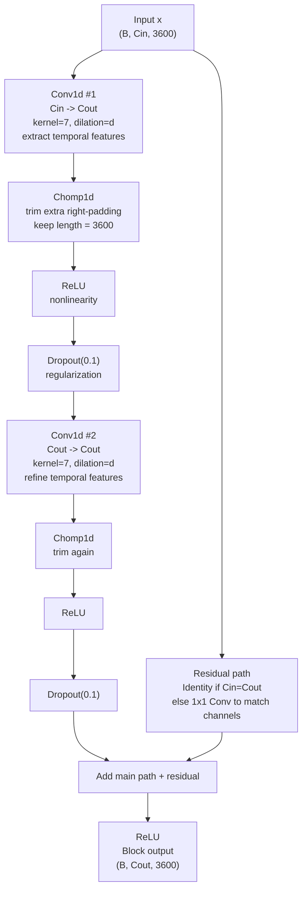

# TCN Architecture Schema

This file describes the **current project-specific TCN** from `configs/default.toml` and `src/ctg_ml/models.py`.

## Current Config Snapshot
- Input length: `3600` timesteps (`60 min * 60 s * 1 Hz`)
- Input channels: `5`
  - `FHR`
  - `toco`
  - `fhr_missing_mask`
  - `toco_missing_mask`
  - `padding_mask`
- TCN channels: `[32, 32, 64, 64, 64, 128, 128, 128]`
- Kernel size: `7`
- Dropout: `0.1`
- Number of temporal blocks: `8`
- Total trainable parameters: `823,137`

## High-Level Flow

```mermaid
flowchart LR
    A["Input CTG sequence<br/>(B, 5, 3600)<br/>5 channels over 60 min"] --> B0["Block 0<br/>5 -> 32 channels<br/>dilation=1<br/>very local patterns"]
    B0 --> B1["Block 1<br/>32 -> 32 channels<br/>dilation=2<br/>slightly wider context"]
    B1 --> B2["Block 2<br/>32 -> 64 channels<br/>dilation=4<br/>combines short motifs"]
    B2 --> B3["Block 3<br/>64 -> 64 channels<br/>dilation=8<br/>looks further back in time"]
    B3 --> B4["Block 4<br/>64 -> 64 channels<br/>dilation=16<br/>mid-range temporal context"]
    B4 --> B5["Block 5<br/>64 -> 128 channels<br/>dilation=32<br/>broad temporal integration"]
    B5 --> B6["Block 6<br/>128 -> 128 channels<br/>dilation=64<br/>long-range context"]
    B6 --> B7["Block 7<br/>128 -> 128 channels<br/>dilation=128<br/>very long-range context"]
    B7 --> P["AdaptiveAvgPool1d(1)<br/>(B, 128, 1)<br/>average over all timesteps"]
    P --> F["Flatten<br/>(B, 128)<br/>sequence summary vector"]
    F --> L["Linear 128 -> 1<br/>(B, 1)<br/>final classifier head"]
    L --> O["Output logit<br/>single risk score before sigmoid"]
```

## Inside One Temporal Block

Each temporal block has the same structure, only `in_channels`, `out_channels`, and `dilation` change.

## Exact Block-by-Block Shapes

The temporal length stays `3600` throughout the TCN because the model uses:
- left/right padding in Conv1D
- `Chomp1d` to remove extra right-side positions
- residual connections with matching temporal length

| Block | Dilation | Channels In -> Out | Output Shape |
|---|---:|---|---|
| Input | - | `5` | `(B, 5, 3600)` |
| 0 | `1` | `5 -> 32` | `(B, 32, 3600)` |
| 1 | `2` | `32 -> 32` | `(B, 32, 3600)` |
| 2 | `4` | `32 -> 64` | `(B, 64, 3600)` |
| 3 | `8` | `64 -> 64` | `(B, 64, 3600)` |
| 4 | `16` | `64 -> 64` | `(B, 64, 3600)` |
| 5 | `32` | `64 -> 128` | `(B, 128, 3600)` |
| 6 | `64` | `128 -> 128` | `(B, 128, 3600)` |
| 7 | `128` | `128 -> 128` | `(B, 128, 3600)` |
| Pool | - | `128` | `(B, 128, 1)` |
| Flatten | - | `128` | `(B, 128)` |
| Linear | - | `128 -> 1` | `(B, 1)` |

## Step-By-Step: What Each Block Does

Use the high-level Mermaid diagram together with this section.

### Input
- Tensor shape: `(B, 5, 3600)`
- `B` is batch size.
- `5` channels are:
  - `FHR`
  - `toco`
  - `fhr_missing_mask`
  - `toco_missing_mask`
  - `padding_mask`
- `3600` timesteps means the full last 60 minutes at 1 Hz.

### Block 0
- Input: `(B, 5, 3600)`
- Output: `(B, 32, 3600)`
- Dilation: `1`
- Role:
  - first layer touching the raw CTG channels
  - detects very local short-timescale patterns
  - maps the 5 input channels into 32 learned feature channels

### Block 1
- Input: `(B, 32, 3600)`
- Output: `(B, 32, 3600)`
- Dilation: `2`
- Role:
  - keeps the same channel width
  - expands the temporal spacing of the convolution
  - starts combining nearby short features into slightly broader motifs

### Block 2
- Input: `(B, 32, 3600)`
- Output: `(B, 64, 3600)`
- Dilation: `4`
- Role:
  - increases feature capacity from 32 to 64 channels
  - lets the model store more different pattern types
  - begins integrating patterns over a wider time span

### Block 3
- Input: `(B, 64, 3600)`
- Output: `(B, 64, 3600)`
- Dilation: `8`
- Role:
  - preserves 64 channels
  - increases effective temporal reach further
  - useful for medium-short events and their local context

### Block 4
- Input: `(B, 64, 3600)`
- Output: `(B, 64, 3600)`
- Dilation: `16`
- Role:
  - still same feature width
  - now combines information from much farther apart positions in time
  - starts building mid-range temporal summaries

### Block 5
- Input: `(B, 64, 3600)`
- Output: `(B, 128, 3600)`
- Dilation: `32`
- Role:
  - doubles the channel width to 128
  - gives the model a larger representation space
  - useful when integrating broad temporal context into richer features

### Block 6
- Input: `(B, 128, 3600)`
- Output: `(B, 128, 3600)`
- Dilation: `64`
- Role:
  - keeps 128 channels
  - sees long-range context
  - can combine information across large chunks of the hour-long trace

### Block 7
- Input: `(B, 128, 3600)`
- Output: `(B, 128, 3600)`
- Dilation: `128`
- Role:
  - deepest temporal block
  - largest temporal spacing
  - final stage of long-range sequence integration before pooling

### Adaptive Average Pooling
- Input: `(B, 128, 3600)`
- Output: `(B, 128, 1)`
- Role:
  - averages each of the 128 learned feature channels over time
  - compresses the whole sequence into one number per channel
  - this is where the model goes from “sequence representation” to “summary representation”

### Flatten
- Input: `(B, 128, 1)`
- Output: `(B, 128)`
- Role:
  - just reshapes the pooled tensor into a vector per sample

### Final Linear Layer
- Input: `(B, 128)`
- Output: `(B, 1)`
- Role:
  - combines the 128 summary features into one final logit
  - this logit is the raw risk score before sigmoid

## What This Means Conceptually

- The model does **not** use a recurrent structure (no LSTM/GRU).
- It sees the whole 60-minute sequence at once.
- It learns temporal patterns using **1D convolutions over time**.
- Early blocks detect short/local motifs.
- Later blocks, thanks to **dilation**, combine information across much longer timescales.
- The final average pooling compresses the whole sequence into one summary vector.
- The linear layer maps that summary to one risk logit.

## Receptive Field

For the current settings:
- `8` blocks
- `2` conv layers per block
- `kernel_size = 7`
- dilations `1, 2, 4, 8, 16, 32, 64, 128`

Approx receptive field:
- `3061` timesteps
- about `51 minutes` at `1 Hz`

Interpretation:
- one output position in the deepest layer can depend on almost the full input hour
- this is why increasing `kernel_size` mattered: it increased how much temporal context each block can integrate

## Why Residual Connections Matter Here

- Every block adds its transformed output back to the input (or a 1x1-projected version of the input).
- This helps optimization in deeper networks.
- It allows the model to preserve useful earlier information instead of having to relearn it in every block.
- In practice, residual connections are one reason an 8-block TCN is trainable at all.

## Why The Time Length Stays 3600

- Each Conv1D uses padding so the convolution can be applied at the edges.
- That padding would normally make the output slightly too long for a causal TCN.
- `Chomp1d` removes the extra right-side positions after each convolution.
- Result:
  - no information leakage from the future
  - constant temporal length through all blocks
  - residual connections remain shape-compatible

## Where This Comes From In The Code
- TCN model definition: `src/ctg_ml/models.py:53`
- Block definition: `src/ctg_ml/models.py:18`
- Current hyperparameters: `configs/default.toml:39`
- Input channels created in preprocessing: `src/ctg_ml/sequence_preprocess.py`
- Training script using this model: `scripts/train_tcn.py`

## If You Want A Prettier Graphic

Best options:

1. Markdown preview with Mermaid
- Open this file in VS Code preview if Mermaid rendering is enabled.

2. `mermaid.live`
- Paste the Mermaid blocks there.
- Export as SVG/PNG.

3. `draw.io` / diagrams.net
- Recreate the diagram manually for presentation-quality output.
- Good if you want colors, spacing, arrows, and notes exactly your way.

4. Netron
- Best for inspecting saved neural network graphs visually.
- More useful after exporting/tracing a model, but not as easy for custom explanatory labels.

## Minimal Mental Model

If you want the simplest accurate summary of this architecture:

`CTG channels over 60 min -> 8 residual dilated Conv1D blocks -> average over time -> linear layer -> risk logit`
